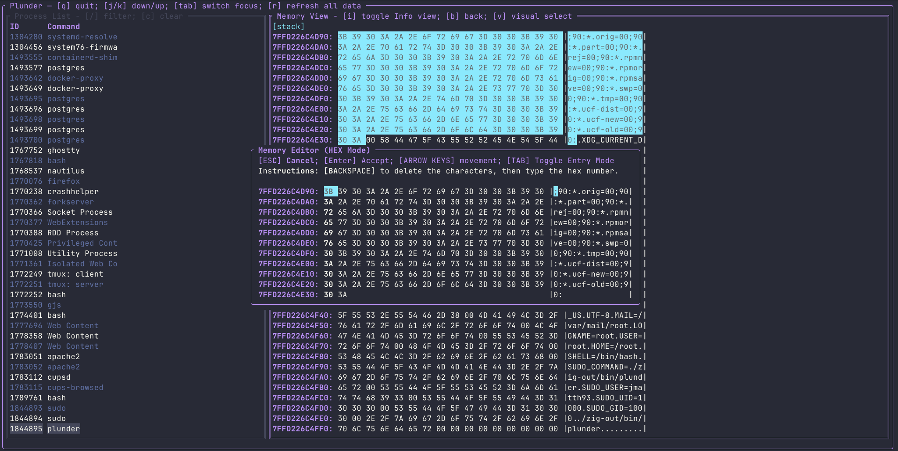

# Plunder



Contents:
- [TUI Demo](#tui-demo)
- [Functionality](#functionality)
    - [Library Features](#library-features)
    - [TUI Features](#tui-features)
- [Build](#build)
    - [TUI](#tui)
    - [Library](#library)
- [Example](#example)
- [Docs](#docs)
- [Testing](#testing)

> [!WARNING]
> This library is still in the early stages and the API may change.

Plunder allows you read/write memory from a running process on linux and grab basic network information.

This repo is a library and a TUI.

## TUI Demo

https://github.com/user-attachments/assets/57faa34b-36e7-4405-83db-68965808aad8

## Functionality

### Library Features

Current functionality:
- Read Memory from a given process.
    - Get the list of region names
    - Read the raw data from the Region.
    - Read only populated data from the Region.
    - Filter regions of memory by scanning all memory between regions for a
      specified search term.
- Write to memory to a given process.
- Read basic network information from a given process.
    - Read what ports and protocols a process is using.

### TUI Features

Most of the instructions for using the TUI are documented at the top of each
panel in the TUI itself.

Functionality list:
- View all processes currently running on the machine.
- View memory regions, raw memory within regions, and process info (cmd line args, env args, network info).
- Filter process list for quickly finding process to view. Filter works on process id and process name.
- Filter on Memory regions by a text you are searching for in memory.
- Search through the memory view for a specific text in memory.
- Edit memory selection in memory view.
    - Edit in hex or text mode.
- Refresh process data in TUI.

## Build

### TUI

The easiest way to build the TUI is like so:
```bash
./build.sh
```

The build script will check to see if you have the right version of zig installed
and if so, use that to build the TUI. Otherwise, it will download a temporary Zig
to use to compile the program then delete the temporary Zig once done.

Run the TUI with:
```bash
sudo ./zig-out/bin/plunder
```

### Library

Include the library into your project like so.

Fetch the library:
```bash
zig fetch --save git+https://github.com/jmatth11/plunder#main
```

Add this to your `build.zig` file.
```zig
    const plunder_dep = b.dependency("plunder", .{
        .target = target,
        .optimize = optimize,
    });
    exe.root_module.addImport("plunder", plunder_dep.module("plunder");
```

## Example

Simple reading from a process ID and getting the populated memory from a certain region.

```zig
const std = @import("std");
const plunder = @import("plunder");

pub fn main() !void {
    const alloc = std.heap.smp_allocator;

    // initialize plunder lib.
    var pl: plunder.Plunder = .init(alloc);
    defer pl.deinit();

    // load mapping info for process ID.
    try pl.load(<pid>);

    // get region names from memory mapping file.
    const names = try pl.get_region_names(alloc);
    if (names) |name| {
        for (name.items) |entry| {
            // operate on names
        }
    }

    // get region data for the heap region.
    const reg_opt = try pl.get_region_data(
        "[heap]",
    );

    if (reg_opt) |*region_ptr| {
        var region = region_ptr.*;
        defer region.deinit();

        // get the non-zero data from the region in a memory list.
        const mem = try region.get_populated_memory(alloc);
        defer mem.deinit();
        for (mem.items) |*memory_ptr| {
            var memory = memory_ptr.*;
            defer memory.deinit();
            for (memory.buffer.?) |c| {
                // operate on buffer data.
            }
        }
    }
}
```

You can also look at `test/heap_read.zig` to see an example of overwriting memory.

## Docs

To view the docs for the repo you need to generate them with this command:
```bash
zig build docs
```

This will generate the docs in `zig-out/docs`.
Next serve this director to view them. The easiest way is with python or python3.

```bash
python3 -m http.server 8000 -d zig-out/docs/
```

Navigate to `http://localhost:8000`. Now you can navigate the docs.

## Testing

The folder `test` contains a simple example of testing against a C program
that allocates memory on the heap.

The `heap_read.zig` file accepts the process ID to read from and searches for
the test text that is allocated in the `dummy.c` file.

You can run this test with the `run_test.sh` script at the top of the repo.


